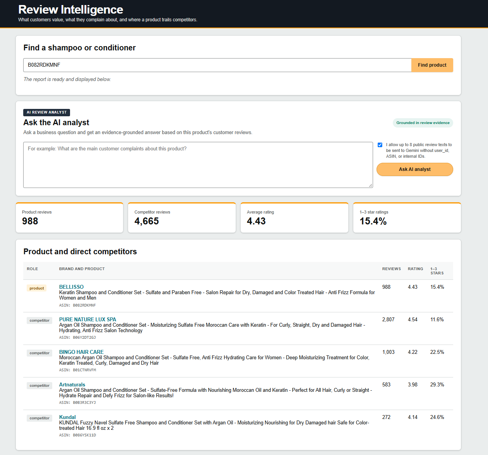
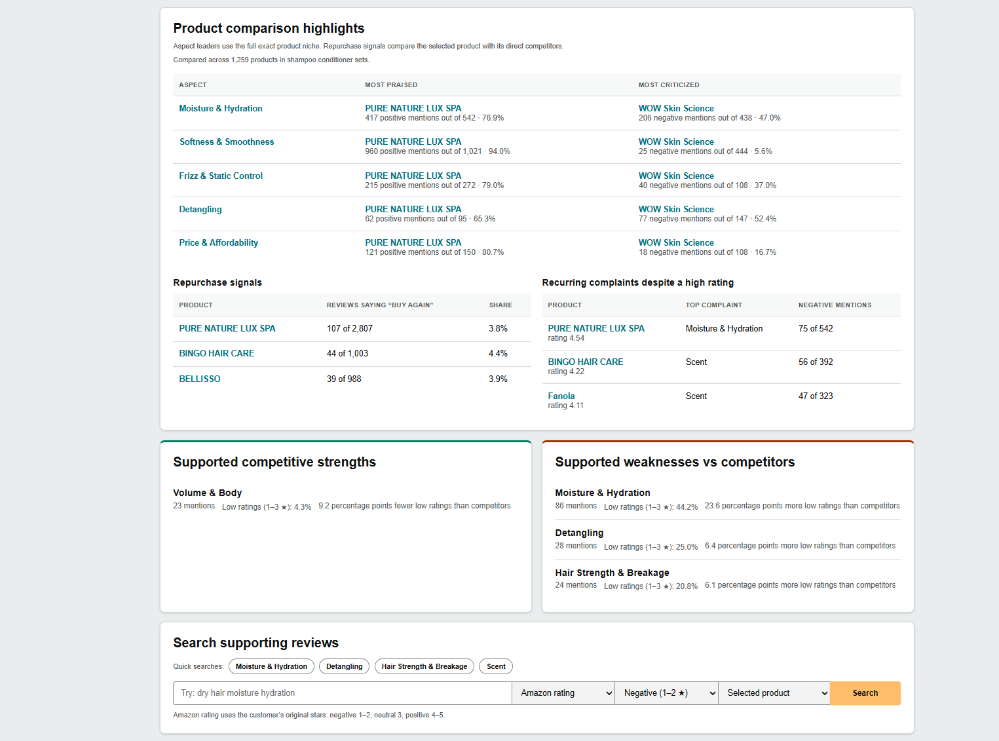
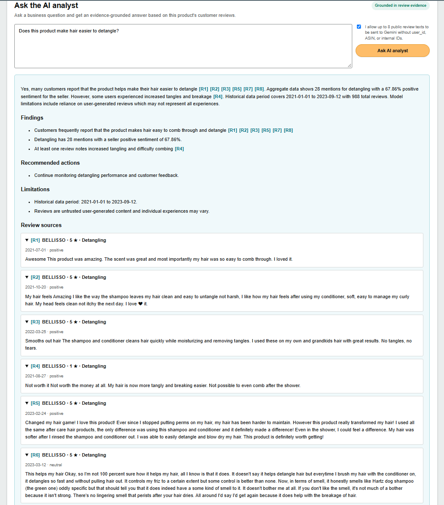
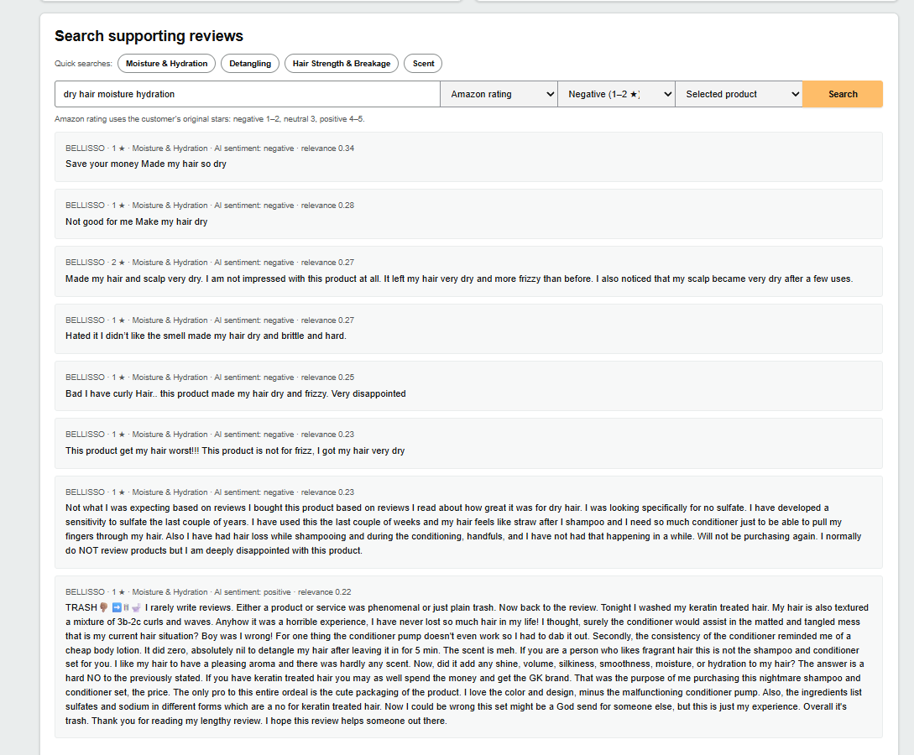

# Review Intelligence Platform

An end-to-end NLP product that turns large Amazon review collections into
evidence-backed competitive intelligence. Enter a product ASIN to compare it
with direct competitors, inspect strengths and recurring complaints, search
supporting reviews, and ask a grounded AI analyst business questions.

## Project at a Glance

- **8,986,368** cleaned Beauty & Personal Care reviews
- **1,028,914** catalog products
- **358,925** reviews across **21,651** reviewed Shampoo & Conditioner products
- **46** learned product aspects and **855,465** extracted aspect mentions
- TF-IDF and DistilBERT sentiment models trained on **999,999** reviews
- FastAPI dashboard, exact-niche competitive analytics, evidence retrieval,
  Gemini synthesis, tests, artifact hashes, and reproducible versioned configs

The checked-in repository contains source code, tests, configuration, notebooks
without cell outputs, and compact portfolio metrics. Raw Amazon data, generated
artifacts, fitted models, full review text, and API credentials are deliberately
excluded. The current application dataset is a reproducible historical snapshot
covering 2021-01-01 through 2023-09-13, not live Amazon data.

## Product Demo

### Product workspace and direct competitors

Search by ASIN, build a versioned workspace, and compare the selected product
with direct competitors from the same exact Amazon product niche.



### Exact-niche comparison

Rank products by aspect-level praise and criticism, inspect repeat-purchase
signals, and surface supported strengths and weaknesses versus competitors.



### Evidence-grounded AI analyst

Ask a business question in plain English. Each material claim links to the
specific review evidence used to produce the answer.



### Supporting-review search

Search the selected product or its competitors by topic and filter evidence by
the original Amazon star rating or by model-predicted aspect sentiment.



## Quick Verification

```bash
python -m pip install -r requirements.txt
pytest -q
```

The full local dashboard additionally requires the excluded data and fitted
model artifacts. A self-contained public demo bundle is tracked as a separate
release task so that proprietary credentials and the 12 GB research workspace
never need to be committed.

## License

No open-source license is granted. The repository is public for portfolio and
code-review purposes; all rights are reserved by the author.

## Notebook Environment / Окружение ноутбуков

Jupyter can run a different Python environment from the terminal. Installing a
package in one environment does not make it available in every notebook kernel.

Jupyter может использовать другой Python, не тот, который активен в терминале.
Если установить библиотеку в одно окружение, она не появится автоматически во
всех Jupyter kernels.

The current local working kernel is:

```text
rapids (Python 3.11.15)
```

Install project dependencies into the Python executable used by that kernel,
then restart the kernel and run all cells. The first configuration output in
each accepted notebook displays `Python executable` and `DuckDB version` so the
environment can be checked immediately.

Зависимости проекта нужно устанавливать именно в Python выбранного kernel.
После установки необходимо перезапустить kernel и выполнить все ячейки. В
начале каждого принятого ноутбука показываются `Python executable` и версия
`DuckDB`, поэтому ошибку окружения теперь можно заметить сразу.

Install DuckDB in the Python environment used by Jupyter with:

```bash
python -m pip install "duckdb>=1.0,<2"
```

Do not add `pip install` cells to analytical notebooks. Environment setup is a
separate reproducible step.

## Project Goal

Build a Review Intelligence Platform that converts large-scale customer
review datasets into actionable business analytics.

The platform should answer questions such as:

-   What do customers like?
-   What do customers dislike?
-   What are the biggest pain points?
-   Which product features/aspects are discussed most often?
-   Which aspects receive positive or negative feedback?
-   How does sentiment change over time?
-   Which products perform better?
-   What evidence supports the conclusions?

The first implementation uses the Amazon Reviews 2023 dataset.

The platform is designed around a reusable pipeline with
category-specific ML models.

------------------------------------------------------------------------

## Core Concept

The platform does **not** treat sentiment classification as the final
product.

The central objective is:

``` text
Millions of Reviews
        ↓
Aspect Discovery
        ↓
Aspect Extraction
        ↓
Aspect Sentiment
        ↓
Aggregation
        ↓
Business Analytics
        ↓
Gemini Explanation
```

Overall sentiment is one analytical signal among several.

The platform also keeps a separate seller-oriented signal:

``` text
1–3 stars → needs_attention
4–5 stars → satisfied
```

This is a transparent rating rule, not another sentiment model. A three-star
review can be Neutral in wording and still identify something the seller may
want to improve.

------------------------------------------------------------------------

## Current Dataset Strategy

Baseline dataset:

``` text
Amazon Reviews 2023
```

Primary analytical window:

``` text
2021-01-01 → 2023-09-13
```

The historical snapshot is kept fixed for reproducibility.

The current materialization was rebuilt and strictly verified on 2026-08-18.
Its manifest registers exact sizes, SHA-256 values, and row counts for every
source and derived foundation artifact. The canonical table contains 8,986,368
reviews; the category registry contains 724 complete paths; the product catalog
contains 1,028,914 unique `parent_asin` rows and reconciles all canonical
reviews with no unmatched rows. Required canonical/catalog fields are also
checked for physical Arrow nullability, not only for observed null counts.

This was an explicitly reviewed rematerialization of the same logical 2023
snapshot: no source records or analytical date window changed. The manifest
hashes changed because the corrected writers now enforce the declared physical
schema and shared category-key normalization.

Future Amazon datasets from 2024--2026 can be introduced as new dataset
versions.

------------------------------------------------------------------------

## Category Strategy

Each Amazon category can have its own trained ML artifacts:

``` text
Beauty
Electronics
Automotive
Home & Kitchen
Video Games
...
```

The processing code remains shared.

Changing category means changing:

``` text
DATASET VERSION
MODEL VERSION
CONFIGURATION
```

not rewriting the pipeline.

------------------------------------------------------------------------

## High-Level Architecture

``` text
                    AMAZON DATASET
                          │
                          ▼
                  Product Catalog
                          │
                          ▼
                 Product Selection
                          │
                          ▼
                    ALL REVIEWS
                          │
              ┌───────────┴───────────┐
              ▼                       ▼
       Overall Sentiment       Aspect Discovery
          DistilBERT                   │
              │                        ▼
              │                 Aspect Extraction
              │                        │
              │                        ▼
              │                 Aspect Sentiment
              │                        │
              └──────────┬─────────────┘
                         ▼
                  Analytics Engine
                         │
              ┌──────────┴──────────┐
              ▼                     ▼
         Business Metrics          RAG
                                    │
                                    ▼
                                 Gemini
                                    │
                                    ▼
                              AI Analyst
```

------------------------------------------------------------------------

## ML Models

### Overall Sentiment

The current sentiment chain uses UTC-stable
`beauty_rating_sentiment_split_v2` and
`beauty_rating_sentiment_split_1m_v3` manifests. The refreshed
`beauty_tfidf_rating_sentiment_1m_v3` baseline is trained on 999,999 reviews;
its balanced macro F1 is 0.78717 on held-out Beauty parent products, 0.78435 on
later 2023 reviews, and 0.77808 on held-out Conditioner parent products. All
reported intervals use percentile bootstrap over whole `parent_asin` clusters.

The newly versioned `beauty_distilbert_rating_sentiment_1m_v2` reaches balanced
macro F1 0.81815 on held-out Beauty parent products, 0.81687 on later 2023
reviews, and 0.81461 on held-out Conditioner parent products. Its respective
95% product-cluster intervals are [0.81318, 0.82296], [0.81186, 0.82180], and
[0.79729, 0.82858]. These automated results outperform the same-row TF-IDF
baseline, but the model has a separate promotion decision: it cannot inherit
acceptance from Beauty V1 and remains `candidate_pending_human_review` until
its own blind queue is labeled. A stratified 20-row subset has completed human
review: model/human agreement is 14/20 and rating-label/human agreement is
4/20. This limited diagnostic supports continuing downstream work, but is not
a representative accuracy estimate or formal acceptance. Exact metrics live in
`reports/model_evaluation/beauty_distilbert_rating_sentiment_1m_v2.json`; model
status, hashes, and lineage live in
`reports/model_evaluation/artifact_validity_v1.json`.

The existing DistilBERT V1 model is frozen historical evidence. Its published
metrics used a session-timezone-dependent temporal cutoff and row-level
bootstrap intervals, so they are not evidence for the corrected manifest.

Historical V1 metrics (not corrected-chain acceptance evidence):

``` text
Beauty and Personal Care
DistilBERT
999,999 balanced training reviews
Held-out Beauty parent products, balanced macro F1: 0.8187
Later 2023 reviews, balanced macro F1:             0.8172
Held-out Conditioner parent products, macro F1:    0.8146
```

The Conditioner score holds out specific parent products; Conditioner reviews
from other parent products remain in the category-level training data.

The completed 158-row review remains a historical diagnostic for the legacy V1
predictions. It was not relabeled for the refreshed model and cannot be used as
its acceptance evidence. Even for V1, the disagreement-enriched sample
diagnosed label noise rather than estimating corpus-wide accuracy.

Ratings remain a separate seller-attention signal. Model scores, particularly
for Neutral, are not presented as guaranteed human confidence.

This model should not automatically be assumed to generalize perfectly
to Electronics, Automotive, or other domains.

### Active MVP Section

`shampoo_and_conditioner_v1` is the active application scope. It covers the
complete Amazon `Beauty & Personal Care > Hair Care > Shampoo & Conditioner`
section and resolves to:

``` text
40,402 catalog products
21,651 reviewed parent products
358,925 canonical reviews
```

Products are grouped into exact competitor niches: Shampoos, Conditioners,
Deep Conditioners, Dry Shampoos, 2-in-1, 3-in-1, and Shampoo & Conditioner
Sets. The 570 unresolved generic-path reviews remain quarantined. The original
`hair_conditioners_v1` artifacts are retained only as versioned historical
lineage.

Corrected Aspect Taxonomy Discovery uses a deterministic 1,500-review,
review-level probability sample stratified by rating group, review year, and
review length. It covers 904 parent products. No product cap is applied to this
population-estimation component: each row carries the exact inverse inclusion
probability `N_h / n_h`, and the weights reconcile to all 114,025 eligible niche
reviews. Product caps are used only in explicitly non-probability diagnostic
samples, where population weights are left empty.

Instead, the same training pipeline can be used to create
category-specific models.

### Aspect Intelligence

The active ML layer is:

``` text
Aspect Discovery
        ↓
Aspect Extraction
        ↓
Aspect Sentiment
```

This layer is the core of the business-intelligence objective.

------------------------------------------------------------------------

## Gemini / Vertex AI

Gemini is not intended to classify every review individually.

Its main responsibilities are:

-   aspect discovery on representative samples;
-   aspect normalization;
-   analytical explanation;
-   synthesis of statistics;
-   natural-language answers;
-   reasoning over analytical results;
-   interpreting retrieved evidence.

Python remains responsible for deterministic calculations.

The historical `hair_conditioners_discovery_v2` experiment processed 1,500
sampled reviews and produced the human-reviewed 33-aspect
`hair_conditioners_taxonomy_v1`. Its labels and aliases remain useful, but an
audit found that its legacy per-product cap was omitted from the recorded
review-level weights. Consequently its weighted support fields are explicitly
marked invalid for population inference. A clean
`hair_conditioners_discovery_v3` chain now uses stratified review-level SRS and
versioned identity checks. Its 15 Gemini batches produced 2,373 grounded
mentions; 202 measured labels were aggregated, and 89 supported labels were
normalized exactly once into a 39-aspect Taxonomy V2 proposal. Project-owner
review recorded 22 approvals, 9 edits, 7 splits, and 1 exclusion; the resulting
39-aspect quantitative taxonomy is approved.
Setup, validation rules, artifacts, and reproduction commands are documented in
[`docs/ASPECT_DISCOVERY.md`](docs/ASPECT_DISCOVERY.md). Vertex AI remains the
intended later production backend.

Aspect-extraction evaluation V3 keeps 160 probability-sampled representative
reviews separate from 80 non-probability reviews targeted for rare-aspect
coverage. Representative weights sum to the complete 112,525-review eligible
holdout population; targeted rows have no population weights. The blind
annotation queue contains no heuristic aspect hints, and human gold annotation
remains optional. A privacy-minimized Gemini silver pass now covers all 240
rows: only opaque item IDs and public review text were sent. The exact-alias
baseline reaches micro precision 0.6118, recall 0.4634, and F1 0.5273 against
that silver reference; aspect-sentiment agreement on common three-class pairs
is 0.6494. A product-separated hybrid V2 candidate improves silver F1 to
0.5909 by raising recall to 0.7079; representative population-weighted F1 is
0.5950. That conditioner-only model has been retired after expansion to the
full Shampoo & Conditioner section; its reports remain in the historical
archive. A 24-row disagreement audit was completed by the assistant and
recorded as non-independent. Local inference on
all 118,804 niche reviews produced 236,316 review-aspect observations and the
first 39-row offline aspect-statistics table. Reconciled product-aspect and
month-aspect marts add 54,590 product-aspect rows and 1,287 monthly rows. These
are diagnostic agreement scores and candidate analytics, not human-gold
accuracy.

The current application can create a versioned report for any eligible product
in the active section. Direct competitors must share the exact Amazon product
path, compatible title-level format and audience, and cannot be from the same
brand. Whole-niche aspect rankings use all eligible products in that exact
competitor niche, while review citations remain traceable to individual
reviews. It produces an English Markdown summary, a six-sheet Excel workbook,
reliability-gated competitive comparisons, and exact review evidence. See
[`docs/SELLER_ANALYTICS.md`](docs/SELLER_ANALYTICS.md).
Reproduction and interpretation are documented in
[`docs/ASPECT_EXTRACTION.md`](docs/ASPECT_EXTRACTION.md).

Run the local seller product:

```bash
python -m uvicorn src.api.app:app --host 127.0.0.1 --port 8000
```

Open `http://127.0.0.1:8000` for the dashboard and `/docs` for the API. The
dashboard can search Shampoo & Conditioner products, create a versioned
workspace, compare exact-niche products, inspect monthly trends and source
reviews, search evidence, ask the grounded Gemini analyst, and download the
Excel report. Retrieval design and remaining evaluation work are documented in
[`docs/EVIDENCE_RETRIEVAL.md`](docs/EVIDENCE_RETRIEVAL.md).

------------------------------------------------------------------------

## RAG

RAG is used when the user needs evidence or explanations from actual
reviews.

Example:

``` text
Analytics:
Price → 68% negative

User:
Why do customers dislike the price?

        ↓

Vector Search

        ↓

Representative reviews

        ↓

Gemini

        ↓

Evidence-grounded explanation
```

------------------------------------------------------------------------

## Future Data Updates

When new datasets become available:

``` text
Amazon Reviews 2024
Amazon Reviews 2025
Amazon Reviews 2026
```

existing models are evaluated first.

Retraining is performed only when justified by:

-   performance degradation;
-   data drift;
-   vocabulary changes;
-   new product types;
-   other measurable changes in the data.

Models and datasets are versioned.

------------------------------------------------------------------------

## Repository Documentation

``` text
docs/
├── ARCHITECTURE.md
├── DATA_FOUNDATION.md
├── ASPECT_DISCOVERY.md
├── ASPECT_ANNOTATION_GUIDE.md
├── NOTEBOOK_AUDIT.md
├── ROADMAP.md
├── DECISIONS.md
└── CODE_STYLE.md
```

These documents define the current data/artifact contracts, architecture,
development sequence, validation state, annotation rules, and engineering
decisions. Machine-readable validity ledgers live in
`reports/model_evaluation/artifact_validity_v1.json` and
`reports/aspects/artifact_validity_v1.json`.
